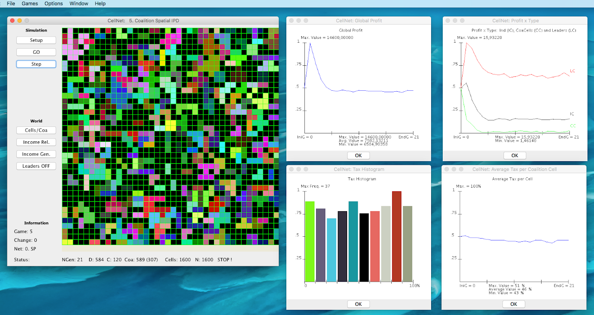
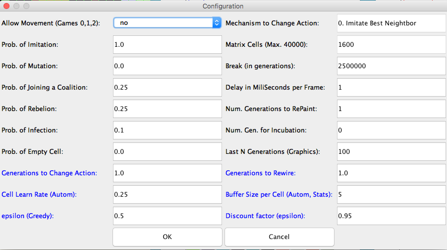
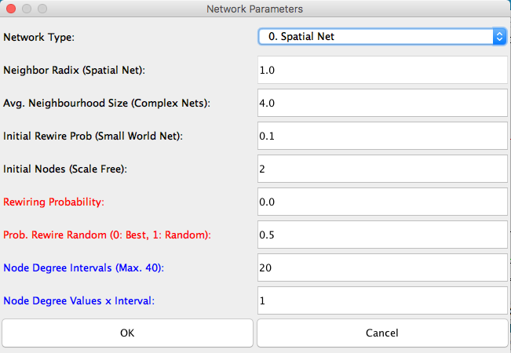

# CellNet: a Hands-on Approach for Agent-based Modeling and Simulation

Cellular Network is a free to use open-source Java-based software, developed by [Juan C. Burguillo](https://sites.google.com/site/jcburgui2) as a research resource to study multi-agent systems, evolutionary game theory and cellular automata simulations. Since released, it has been used in a number of research works by the author, Ph.D. students and some research colleagues from other Universities.


## Table of Contents
1. [CellNet Basic Features](#cellnet-basic-features)
2. [How to use CellNet](#how-to-use-cellnet)
3. [CellNet and the Book "Self-organizing Coalitions for managing Complexity"](#cellnet-and-the-book-self-organizing-coalitions-for-managing-complexity)
4. [CellNet Snapshots](#CellNet-Snapshots)
5. [Citing](#citing)
6. [License](#licence)
7. [Acknowledgements](#acknowledgements)


## CellNet Basic Features
CellNet has its origins in 2003, a time were most of the simulators were too complex or do not provide enough tools to comfortably manage cellular automata networks and evolutionary game theory simulations in Java with user-friendly interfaces.

CellNet works in two modes: i) using a graphical user interface (GUI) for doing micro-simulations or ii) using a batch mode for doing macro-simulations. CellNet also provides support for:

- Visualizing the whole set of cells and their state along each simulation iteration.
- Visualizing the simulation results in real time at each iteration. A set of graphical windows are provided for every relevant simulation result.
- Importing network data to reuse particular network structures to run experiments.
- Exporting network data, to save a particular network structure. The format used for the exported files is compatible with popular network analyzers such as Pajek or Gephi.


## How to use CellNet

A few steps are described next in order to use, program and understand the framework:

1. **Running CellNet in standalone version**: just double-click or execute from the shell the CellNet.jar file provided in the distribution. You must have installed the Java 1.8 version.

2. **Opening CellNet in Eclipse**: the framework has been programmed in Java using Eclipse, and should be easily open as an Eclipse project. Just decompress the CellNet.zip file to have a CellNet folder that you must import as a project from Eclipse.

3. **Documentation**: simply open the “Intro2CellNet.pdf” file included in the distribution for a brief introduction to Cellnet. Besides, the source files are fully commented.

4. **API**: the document “Intro2CellNet.pdf”, included in the distribution, contains a short API description. You can also use the CellNet API.zip file, containing the documentation generated by “javadoc”.


## CellNet and the Book "Self-organizing Coalitions for managing Complexity"
CellNet allows a hands-on approach to simulating and modifying most of the coalition-based experiments presented in the book:

Self-organizing Coalitions for Managing Complexity by Juan C. Burguillo, that appeared in the Springer ECC series (Emergence, Complexity and Computation 29). ©Springer Nature 2018. (https://doi.org/10.1007/978-3-319-69898-4)

Following the book, the readers can test the simulations by means of:

- **Running Micro-simulations**: most of the experiments described in the research chapters (except the ones from chapter 10 about Electrical Vehicles and SmartGrids, which were programmed in Netlogo) can be directly run in a one-shot mode, selecting them directly from the main menu of the simulator. The different game simulation parameters can be reviewed and modified from the experiment option window, or from a general configuration window. No programming skills are needed to run the simulator in this mode, so the reader can explore the contents of the book, repeat some experiments or perform new ones by just selecting different parameter values.
- **Running Macro-simulations**: having very basic general programming skills allows the reader to configure some batch files to execute a set of experiments, involving multiple runs, to analyze the average results provided by such set of game simulations.
- **Modifying the algorithms**: readers having standard Java programming skills can redesign their own algorithms, and then test the behaviors obtained by performing new experiments. For this, new algorithms can be created from scratch, or more commonly, the algorithm files already included can be inherited and used as templates. CellNet code includes support for generating different types of complex topologies, using several machine learning techniques, performing evolutionary meta-decisions, generating real-time visualizations and interacting with external network analyzers.


## CellNet Snapshots

Find next some images describing the framework shape, and how to configure networks and games:

- A Framework snapshot with the coalition spatial IPD game



- Framework Configuration Window



- Network Parameter Window




## Citing

You may cite this repository in the following way:
```
@misc{Burguillo2018,
  author = {Burguillo, Juan C.},
  title = {CellNet: a Hands-on Approach for Agent-based Modeling and Simulation},
  year = {2018},
  publisher = {GitHub},
  journal = {GitHub repository},
  howpublished = {\url{https://github.com/jcburguillo/CellNet}},
}
```

## Licence

    CellNet is released under the GNU General Public Licence, version 3 or later.


## Acknowledgements

    Some parts of the framework have been programmed by Ana Peleteiro when performing her PhD. Thesis.
